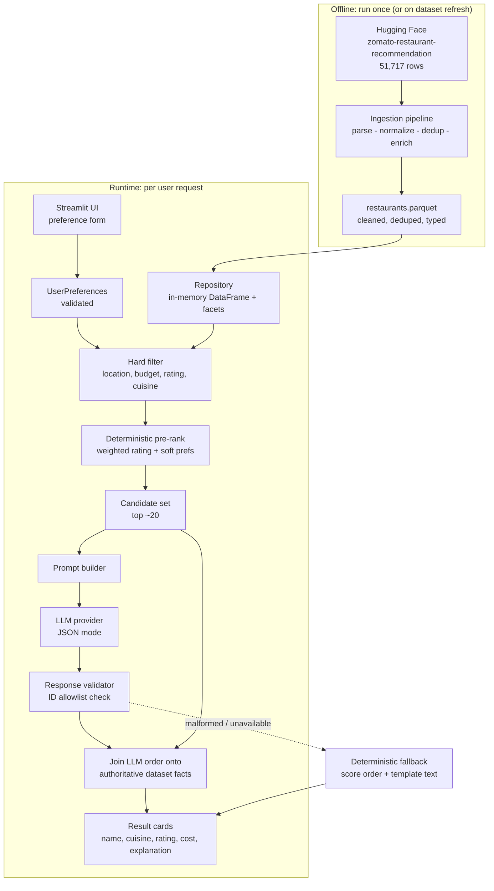

# Architecture: AI-Powered Restaurant Recommendation Service

Companion to [`problemStatement.md`](./problemStatement.md). This document describes how the system is structured, what each module owns, the data contracts between layers, and the design decisions behind them.

---

## 1. Guiding Principles

1. **The dataset is the source of truth; the LLM is a ranker and explainer.** Every factual field shown to the user (name, cuisine, rating, cost) comes from the dataset. The LLM never supplies facts, only ordering and prose. This is enforced in code, not just in the prompt (see §8.3).
2. **Deterministic filtering before probabilistic reasoning.** Hard constraints (location, budget, minimum rating) are applied with pandas, which is exact, cheap, and testable. Only a small candidate set reaches the LLM.
3. **Preprocess once, offline.** The raw dataset is large and messy. Cleaning happens in a batch job that produces a compact artifact; the app loads only that artifact.
4. **Degrade rather than fail.** If the LLM is unavailable, rate-limited, or returns malformed output, the app still returns deterministically ranked results with template explanations.

---

## 2. Dataset Reality Check

I profiled the Hugging Face dataset ([`ManikaSaini/zomato-restaurant-recommendation`](https://huggingface.co/datasets/ManikaSaini/zomato-restaurant-recommendation)) before designing around it. The findings below drive most of the ingestion design, and one of them changes the product scope.

| Property | Value |
| --- | --- |
| Rows | 51,717 (single `train` split) |
| Columns | 17 |
| **Unique restaurants** | **12,453** (see §2.3 — the row count is ~4× inflated) |
| On-disk (Parquet) | ~145 MB |
| In-memory (raw) | ~575 MB |

All figures in this section were measured directly against the Parquet files, not estimated.

### 2.1 Scope constraint: this is a Bangalore-only dataset

**The problem statement's example of "Delhi, Bangalore" as location choices cannot be satisfied by this dataset.** It is the well-known Zomato Bangalore dataset. The `listed_in(city)` column does not contain cities — it holds 30 Bangalore sub-areas such as `Banashankari`, `Brookefield`, `HSR`, `Kalyan Nagar`, `Koramangala 5th Block`, `Malleshwaram`, `Residency Road`, and `Whitefield`. The `location` column is a finer-grained neighborhood with 93 distinct values.

The architecture therefore treats **"location" as a Bangalore neighborhood, not a city**, and the UI presents a dropdown of real values from the data rather than a free-text city box. This is called out in §11 as the one open product decision.

### 2.2 Column inventory and handling

| Raw column | Type | Condition | Handling |
| --- | --- | --- | --- |
| `url` | string | **Unique on every one of the 51,717 rows** because of a trailing `?context=<base64>` param — so it is *not* a usable dedup key as-is | Strip the query string to get the canonical path (12,453 distinct); hash that for the stable `id`, keep the path as the "view on Zomato" link |
| `name` | string | 8,792 distinct, some encoding artifacts (`Ã` sequences) | Unicode-repair, strip |
| `address` | string | Clean | Part of the fallback dedup key; shown in the UI |
| `location` | string | 93 neighborhoods, 21 nulls | Primary location facet |
| `listed_in(city)` | string | 30 Bangalore sub-areas, **not cities**, no nulls | Secondary/coarse location facet |
| `cuisines` | string | Comma-separated multi-value, 45 nulls | Split to `list[str]`, normalized |
| `rest_type` | string | Comma-separated multi-value, 93 distinct combos, 227 nulls | Split to `list[str]`; drives soft preferences |
| `dish_liked` | string | **63% null** after dedup, comma-separated | Split to `list[str]`; optional prompt signal only |
| `rate` | string | 65 distinct values: `"4.1/5"`, inconsistent whitespace (`"4.1 /5"`), literal `"NEW"` (2,208 rows), a bare `'-'`, and 7,775 nulls | Regex-parse to `float`; `NEW`/`'-'`/null → `None`. Parsed values span 1.8–4.9; **25.6% of unique restaurants end up unrated** |
| `votes` | int64 | Clean, 0–16,832, but **median is only 24** | Used for confidence weighting (§7.2) |
| `approx_cost(for two people)` | string | **Thousands separators** (`"1,200"`), 70 distinct values, few nulls | Strip commas → `int`; actual range ₹40–₹6,000 |
| `online_order` | string | `"Yes"`/`"No"` | → `bool` |
| `book_table` | string | `"Yes"`/`"No"` | → `bool` |
| `listed_in(type)` | string | 7 values: Buffet, Cafes, Delivery, Desserts, Dine-out, Drinks & nightlife, Pubs and bars | Meal-context facet |
| `phone` | string | Some nulls, multi-line | Dropped (not needed, mild PII) |
| `reviews_list` | string | **Stringified Python list of tuples; dominates dataset size** | Truncated: extract 2 short snippets, drop the rest |
| `menu_item` | string | Mostly empty lists | Dropped |

### 2.3 The row count is ~4× inflated by duplicates

The same physical restaurant appears multiple times because it is listed once per `listed_in(type)` × `listed_in(city)` combination. Measured distribution: 2,160 restaurants appear once, 3,272 appear twice, and the rest appear 3 to 10+ times. **51,717 rows collapse to 12,453 real restaurants.** Deduplicating is mandatory, or the UI will show the same place repeatedly.

Choosing the key requires care. The obvious candidate, `url`, is unique on every row and would silently deduplicate nothing, because each listing carries a different `?context=` tracking parameter:

```
https://www.zomato.com/bangalore/jalsa-banashankari?context=eyJzZSI6eyJlIjpb...
                                                   ^^^^^^^^ differs per listing
```

The pipeline therefore keys on the **URL path with the query string stripped** (12,453 groups), falling back to `(normalized_name, address)` (12,499 groups) when the path is missing. The two agree closely, which is a good cross-check that neither is over- or under-merging.

This is worth a test assertion: after ingestion, the row count should be ~12.4k. If it comes out near 51.7k, deduplication silently failed.

---

## 3. Technology Choices

| Concern | Choice | Rationale |
| --- | --- | --- |
| Language | Python 3.11+ | Best fit for the data stack and every LLM SDK |
| Data processing | pandas + PyArrow | Dataset fits comfortably in memory after cleaning; no need for Spark/DuckDB |
| Dataset access | `datasets` (Hugging Face) | Canonical loader for the source; used only in the offline job |
| Cleaned artifact | Parquet | Columnar, compressed, preserves dtypes, loads in well under a second |
| UI | Streamlit | Fastest path from Python functions to a usable interface; no separate frontend build |
| Validation / contracts | Pydantic v2 | Typed boundaries for user input and LLM output, with parsing built in |
| LLM access | Provider-agnostic interface over an OpenAI-compatible client | Swap models without touching the pipeline; supports JSON-mode responses |
| Config | `pydantic-settings` + `.env` | Keeps the API key out of code and out of git |
| Tests | pytest | Filters and parsers are pure functions and highly testable |

**Deliberately excluded:** a vector database and RAG. Every hard constraint in the brief is structured (location, cost, rating, cuisine), so SQL/pandas-style filtering is more precise and cheaper than embedding search. Semantic matching is only useful for the free-text "additional preferences" field, which §11 addresses as an optional extension.

---

## 4. High-Level Architecture



The five stages in the problem statement map onto this as: **Data Ingestion** = the Offline box; **User Input** = UI → `UserPreferences`; **Integration Layer** = filter → pre-rank → prompt builder; **Recommendation Engine** = LLM → validator; **Output Display** = merge → result cards.

---

## 5. Project Layout

```
Zomato_proj/
├── app/
│   └── streamlit_app.py          # UI entry point: form, results, wiring only
├── src/zomato_reco/
│   ├── config.py                 # Settings: paths, model name, API key, tunables
│   ├── models.py                 # Pydantic: UserPreferences, Restaurant, Recommendation
│   ├── ingest/
│   │   ├── download.py           # Pull the HF split to local cache
│   │   ├── clean.py              # Field-level parsers (pure, unit-tested)
│   │   └── build_artifact.py     # CLI: raw -> restaurants.parquet + facets.json
│   ├── data/
│   │   └── repository.py         # Load artifact, expose facets and query surface
│   ├── recommend/
│   │   ├── filters.py            # Hard constraints
│   │   ├── scoring.py            # Weighted rating + soft-preference boosts
│   │   └── pipeline.py           # Orchestrates filter -> score -> LLM -> merge
│   ├── llm/
│   │   ├── base.py               # LLMClient protocol
│   │   ├── openai_client.py      # Concrete implementation
│   │   ├── prompts.py            # System + user prompt templates
│   │   └── parser.py             # Parse, validate, and repair LLM JSON
│   └── ui/
│       └── components.py         # Reusable Streamlit rendering helpers
├── data/
│   ├── raw/                      # HF cache (gitignored)
│   └── processed/                # restaurants.parquet, facets.json (gitignored)
├── tests/
│   ├── test_clean.py             # "4.1 /5" -> 4.1, "1,200" -> 1200, "NEW" -> None
│   ├── test_filters.py           # Constraint correctness, empty-result behavior
│   ├── test_scoring.py           # Low-vote restaurants don't outrank proven ones
│   └── test_parser.py            # Hallucinated IDs rejected, malformed JSON handled
├── docs/
│   ├── problemStatement.md
│   └── architecture.md
├── .env.example
└── pyproject.toml
```

Business logic lives in `src/` as plain functions, so the pipeline is fully usable and testable without Streamlit running. `app/` is a thin presentation shell.

---

## 6. Layer 1 — Data Ingestion (Offline)

Run as `python -m zomato_reco.ingest.build_artifact`. Output: `data/processed/restaurants.parquet` plus `facets.json` (dropdown values and calibrated budget thresholds).

### 6.1 Pipeline steps

1. **Load** the `train` split via `datasets.load_dataset`.
2. **Drop heavy/unused columns** first (`menu_item`, `phone`) and immediately reduce `reviews_list` to two short snippets. Doing this early is what keeps memory from ballooning past half a gigabyte.
3. **Parse fields** using the pure functions in `clean.py`:
   - `parse_rating("4.1 /5") -> 4.1`, `"NEW" -> None`, `None -> None`
   - `parse_cost("1,200") -> 1200`
   - `parse_yes_no("Yes") -> True`
   - `split_multi("North Indian, Chinese") -> ["North Indian", "Chinese"]`
   - `fix_encoding(...)` repairs mojibake in names and review text
4. **Deduplicate** on the stripped URL path (§2.3), keeping the row with the most `votes`; aggregate the `listed_in(type)` and `listed_in(city)` values of the dropped siblings into `meal_contexts` and `city_areas` lists so no information is lost. Assert the output is ~12.4k rows.
5. **Enrich** with derived columns:
   - `id` — short stable hash of `url`
   - `budget_band` — `low` / `medium` / `high`, from cost percentiles (§6.2)
   - `weighted_rating` — vote-adjusted score (§7.2), precomputed
   - `is_family_friendly`, `is_quick_service` — heuristic flags from `rest_type` and `listed_in(type)`
6. **Filter out unusable rows**: missing name, or missing both rating and cost.
7. **Write** Parquet with Snappy compression, and emit `facets.json`.

### 6.2 Budget bands are calibrated, not hardcoded

Cost for two ranges from ₹40 to ₹6,000 and is heavily right-skewed. Rather than inventing thresholds, the ingestion job computes the 33rd and 66th percentiles of the deduplicated distribution and freezes them into `facets.json`:

```
low    : cost <= p33
medium : p33 < cost <= p66
high   : cost > p66
```

Measured against the 12,453 deduplicated restaurants, **p33 = ₹300 and p66 = ₹500**. Note how tight that middle band is — a hand-picked "medium = ₹500–1,500" would have misclassified the majority of the dataset as low-budget. This is exactly why the thresholds are derived rather than guessed. Freezing them at build time keeps runtime filtering deterministic and lets the UI label the bands concretely ("medium = ₹300–₹500 for two").

### 6.3 Cleaned record schema

```python
class Restaurant(BaseModel):
    id: str
    name: str
    location: str  # Bangalore neighborhood
    city_areas: list[str]  # listed_in(city) values; up to 14 per restaurant
    address: str
    cuisines: list[str]
    rest_types: list[str]
    meal_contexts: list[str]  # Buffet, Delivery, Dine-out, ...
    rating: float | None  # 0.0-5.0, None for unrated/NEW
    votes: int
    weighted_rating: float  # vote-adjusted, used for ordering
    cost_for_two: int | None
    budget_band: Literal["low", "medium", "high"] | None
    online_order: bool
    book_table: bool
    dish_liked: list[str]  # often empty
    review_snippets: list[str]  # max 2, truncated
    url: str
```

---

## 7. Layer 2 — Integration Layer (Filter and Pre-Rank)

### 7.1 Hard filters

Applied in `filters.py`, cheapest and most selective first, against the in-memory DataFrame:

| Preference | Filter semantics |
| --- | --- |
| Location | Exact match on `location`. See the relaxation note below — `city_areas` is **not** a valid widening target |
| Budget | `budget_band` equality; optionally "at or below" for the low band |
| Minimum rating | `rating >= min_rating`; unrated rows excluded when a minimum is set |
| Cuisine | Any-overlap between requested cuisines and the `cuisines` list |
| Meal context | Any-overlap on `meal_contexts` when supplied |

**Progressive relaxation.** An over-constrained query returning zero rows is a bad user experience, so if the result set is smaller than a floor (default 5), constraints are relaxed in a fixed, user-visible order: meal context, then cuisine broadened to related cuisines, then rating lowered by 0.3, then location. Every relaxation is recorded and surfaced in the UI ("no Italian under ₹300 in HSR, so I widened the budget"). Budget is relaxed last because it is the constraint users are least willing to bend.

**Location cannot be relaxed via `city_areas`.** `listed_in(city)` is a Zomato *search listing area*, not a geographic parent of `location` — a single restaurant is listed in up to 14 of them (mean 2.69). Measured consequence: "widening" Whitefield from its 886 restaurants to the union of its listing areas yields 7,510, or 60% of the entire dataset, including places across the city. Location relaxation must therefore either use an explicit neighborhood adjacency map or drop the constraint outright with a clear notice. See `edge-case.md` **C2**.

### 7.2 Vote-weighted rating

A naive `rating` sort promotes a 4.9-rated place with 4 votes over a 4.5 with 3,000. The pipeline uses an IMDb-style Bayesian shrinkage toward the global mean:

```
weighted_rating = (v / (v + m)) * R + (m / (v + m)) * C

R = the restaurant's rating
v = its vote count
m = minimum-votes constant (default 50)
C = global mean rating across the deduplicated dataset = 3.625 (measured)
```

Low-vote restaurants are pulled toward 3.625 until they earn enough votes to move away from it. Computed once during ingestion.

This matters more here than it would in a typical dataset: **the median restaurant has just 24 votes**, so more than half the catalogue sits below the `m = 50` prior and gets meaningfully shrunk. That is the desired behavior — a 4.8 from 11 reviewers is weak evidence — but it makes `m` the most impactful tuning knob in the system. Raising it trusts vote counts more and surfaces established restaurants; lowering it lets promising newcomers through. It belongs in `config.py`, not inline.

Restaurants with no rating at all (25.6%, including the 2,208 `"NEW"` rows) are excluded whenever the user sets a minimum rating, and otherwise sorted last rather than treated as 0.0, which would be a false negative signal.

### 7.3 Soft-preference scoring

Free-text extras ("family-friendly", "quick service", "good for a date") become small additive boosts on top of `weighted_rating` — keyword matching against `rest_types`, `meal_contexts`, `dish_liked`, and the boolean convenience flags. These only reorder the candidate pool; the LLM does the nuanced interpretation. Weights live in `config.py` rather than scattered as literals.

### 7.4 Candidate set sizing

Top **20** candidates go to the LLM (configurable). The reasoning: 20 compact records is roughly 2,000–2,500 prompt tokens, which is cheap and fast; it gives the model genuine ranking latitude for the ~5 results shown; and it stays well clear of the "lost in the middle" degradation seen with long candidate lists. Each candidate is serialized as compact JSON with only the fields the model needs — no URLs, no addresses, no raw review dumps.

---

## 8. Layer 3 — Recommendation Engine (LLM)

### 8.1 Provider abstraction

```python
class LLMClient(Protocol):
    def complete_json(self, system: str, user: str, schema: dict) -> dict: ...
```

`pipeline.py` depends only on this protocol, so tests inject a stub and the concrete provider stays swappable. Default configuration: temperature `0.3` (near-deterministic prose while keeping explanations readable), JSON response mode, and a bounded `max_tokens`.

### 8.2 Prompt design

**System prompt** establishes the role and the non-negotiable rules: recommend *only* from the provided candidates; reference each restaurant by its exact `id`; never invent or alter a name, rating, or price; write one to two sentences per explanation that tie back to the user's stated preferences; state the tradeoff honestly when a candidate is an imperfect fit; return JSON matching the schema and nothing else.

**User message** carries the preferences (including the raw free-text extras) followed by the candidate JSON array and the requested result count.

**Response schema:**

```json
{
  "recommendations": [
    {"id": "a3f9c1", "rank": 1, "explanation": "...", "match_highlights": ["4.4 rating", "under budget"]}
  ],
  "summary": "Optional one-paragraph overview of the set."
}
```

Asking for IDs rather than names is the single most important prompt decision — it makes hallucination mechanically detectable, since an ID either is or is not in the candidate allowlist.

### 8.3 Response validation (the anti-hallucination gate)

`parser.py` enforces, in order:

1. Parse JSON; on failure, retry once with the parse error appended, then fall back.
2. Validate against the Pydantic schema.
3. **Allowlist check:** drop any `id` not in the candidate set.
4. Deduplicate IDs and renumber ranks contiguously.
5. If fewer than the requested count survive, backfill from the deterministic score order.
6. **Discard all factual claims from the model.** Only `explanation`, `match_highlights`, `summary`, and the ordering are kept; name, cuisine, rating, and cost are re-joined from the dataset by ID.

Step 6 is what makes the "dataset is the source of truth" principle structural rather than aspirational. Even a model that fabricates a rating in prose cannot corrupt a displayed field.

### 8.4 Failure modes

| Failure | Behavior |
| --- | --- |
| Missing/invalid API key | Detected at startup; app runs in deterministic mode with a visible banner |
| Timeout or network error | One retry with backoff, then deterministic fallback |
| Rate limit (429) | Respect `Retry-After` once, then fall back |
| Malformed JSON | One repair retry, then fall back |
| Hallucinated IDs | Silently dropped, backfilled from score order |
| Empty candidate set | Skip the LLM entirely; show relaxation suggestions |

Fallback explanations are generated from templates over real fields ("4.4 rating from 1,200 votes, ₹600 for two, serves North Indian"). Results remain useful, just less conversational.

### 8.5 Caching

Two layers, both keyed by content hash: the Parquet load is cached for the process lifetime (`st.cache_data`), and LLM responses are cached on `hash(preferences + candidate_ids + model + result_count)`. Identical repeat searches — common when a user toggles the UI back and forth — cost nothing and return instantly.

---

## 9. Layer 4 — Output Display (Streamlit)

**Input sidebar:** location dropdown (from `facets.json`), budget radio with the calibrated rupee ranges shown inline, multi-select cuisines, a rating slider, a free-text extras box, and a result-count selector. Populating dropdowns from the artifact means users can only express queries the data can answer.

**Results area:** any relaxation notices first, then one card per recommendation with rank and name as the heading, cuisine tags, rating with vote count, cost for two, the AI explanation, convenience badges (online ordering, table booking), and a Zomato link. The optional summary sits above the cards. Each card includes a small "why this rank" expander showing the deterministic score components, which makes the ranking auditable instead of opaque.

**States handled explicitly:** initial (empty, with guidance), loading (spinner during the LLM call), zero-results-after-relaxation (show which constraint is binding), and degraded (banner explaining that explanations are template-generated).

---

## 10. Cross-Cutting Concerns

**Configuration.** All tunables — artifact paths, model name, temperature, candidate count, `m` constant, soft-preference weights, relaxation floor — live in `config.py` via `pydantic-settings`, overridable by `.env`. The API key is read from the environment only; `.env` and `data/` are gitignored, and `.env.example` documents the required variables.

**Testing.** Field parsers get table-driven tests over the real quirks found in §2.2 (`"4.1 /5"`, `"1,200"`, `"NEW"`, nulls). Deduplication gets an explicit test that the same restaurant with two different `?context=` URLs collapses to one row, plus a post-ingestion assertion on the ~12.4k row count — the failure mode here is silent, so it needs a guard. Filters are tested on a small hand-built DataFrame including the over-constrained-relaxation path. Scoring asserts the low-vote-doesn't-win property. The parser is tested against hallucinated IDs, duplicate IDs, malformed JSON, and short responses. The pipeline gets one end-to-end test with a stub LLM client, so CI needs no API key.

**Observability.** Structured logs per request: candidate count, relaxations applied, LLM latency, token usage, cache hit/miss, and validation drops. Token usage and dropped-ID counts are the two numbers worth watching, since they track cost and model reliability respectively.

**Performance.** Artifact load is a one-time sub-second cost; filtering across 12,453 deduplicated rows is single-digit milliseconds; the LLM call dominates at roughly 2–5 seconds. No optimization is warranted beyond caching the LLM call. For reference, reading both raw Parquet files and computing full-column statistics took under two seconds locally, so the data volume here is never the bottleneck.

---

## 11. Open Decisions and Extensions

**One decision needs your input:** the dataset covers only Bangalore (§2.1), so the brief's "Delhi, Bangalore" example is not achievable as written. The options are to reframe the app as a Bangalore neighborhood recommender (accurate, no extra work), to supplement with an additional multi-city dataset (more work, inconsistent schemas), or to keep city-level UI wording and accept that only Bangalore returns results (misleading; not recommended). The architecture above assumes the first.

**Deferred extensions,** none of which the current design forecloses: semantic search over `dish_liked` and review snippets for free-text queries that keyword matching handles poorly; conversational refinement ("cheaper, but keep it Italian") via a chat-style loop over retained candidate state; a FastAPI layer if a non-Streamlit client is ever needed, since the business logic already sits behind plain functions; and richer review mining, given that the ingestion job currently discards most review text to control size.

---

## 12. Build Order

Each step produces something verifiable, so problems surface early rather than at integration time.

1. Scaffold the project, `pyproject.toml`, and config.
2. Write `clean.py` parsers with their tests — the messiest, most bug-prone code, tested in isolation first.
3. Build `build_artifact.py`; confirm the output lands at ~12,453 rows and that the computed budget percentiles come out at ₹300 / ₹500. Both are known-good targets from §2, so a mismatch means a bug in the cleaning step.
4. Implement the repository and hard filters against the real artifact.
5. Add scoring and relaxation. **At this point the app is fully functional without any LLM**, which is the natural checkpoint to validate that results look sensible.
6. Add the LLM client, prompts, and parser with the anti-hallucination gate.
7. Build the Streamlit UI.
8. Add caching, logging, and the end-to-end stub test.
