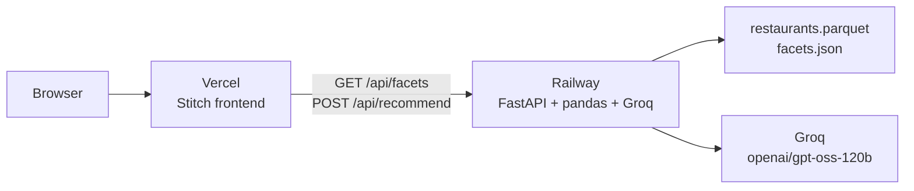
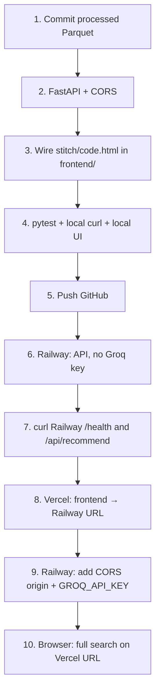

# Deployment Plan: Railway (backend) + Vercel (frontend)

How to take this Bangalore restaurant recommender from a local Streamlit app to a public site: **FastAPI on Railway**, **Stitch UI on Vercel**.

Companion to [`architecture.md`](./architecture.md) and [`implementation-plan.md`](./implementation-plan.md). This is an execution plan, not a status report — most of the split does not exist in the repo yet.

---

## 1. Why this split

Vercel hosts static sites and Node serverless functions. It cannot run this Python stack (pandas, Parquet, Groq, Streamlit). Railway can.

The recommendation logic already sits behind plain functions (`pipeline.recommend`, `get_repository`). Architecture §11 and implementation Phase 8 called a FastAPI layer a cheap add-on for exactly this reason. The latest frontend is the Stitch dark theme (`stitch/code.html`, committed as `e35db8b` on Streamlit). That HTML is the Vercel surface; Streamlit stays a local/dev UI, not the production site.



**Do not deploy Streamlit to Vercel.** **Do not put `GROQ_API_KEY` on Vercel.** The key only belongs on Railway.

---

## 2. Current repo vs. what production needs

| Piece | Today | Needed for Railway + Vercel |
| --- | --- | --- |
| Ranking / filters / LLM gate | `src/zomato_reco/` — ready | Unchanged |
| HTTP API | None | FastAPI wrapping `recommend()` |
| Latest UI | Streamlit with Stitch CSS (`app/streamlit_app.py`) plus static mock `stitch/code.html` | Wire `stitch/code.html` to the API and host it on Vercel |
| Cleaned catalog | Local `data/processed/` (~3.1 MB Parquet + 5 KB `facets.json`), **gitignored** | Must ship with the Railway service |
| Secrets | Local `.env` (`GROQ_API_KEY`) | Railway env vars only |
| Git remote | None (`git remote -v` is empty) | GitHub (or GitLab) so both platforms can auto-deploy |
| Python | 3.11+, `pyproject.toml` | Same; add `fastapi` + `uvicorn` |
| Node frontend | None | Small static (or Vite) app under `frontend/` |

Until the API and the wired frontend exist, there is nothing useful to point Railway or Vercel at.

---

## 3. Target layout

```
Zomato_proj/
├── app/
│   ├── api.py                 # NEW — FastAPI app
│   └── streamlit_app.py       # keep for local demos; not production
├── frontend/                  # NEW — Vercel root
│   ├── index.html             # Stitch UI, live against the API
│   ├── app.js
│   ├── styles.css             # or keep Tailwind CDN as in stitch/code.html
│   ├── package.json           # optional Vite; static HTML is enough
│   └── vercel.json
├── src/zomato_reco/           # unchanged business logic
├── data/processed/            # NEW — commit these two files (see §6)
│   ├── restaurants.parquet
│   └── facets.json
├── railway.toml               # NEW
├── Dockerfile                 # optional; Nixpacks is enough
├── docs/deployment-plan.md
└── pyproject.toml             # add fastapi, uvicorn[standard]
```

Monorepo is the intended shape: one GitHub repo, two platform projects with different root directories.

---

## 4. Work that must land before any deploy

Each step has an exit check. Do them in this order. Do not create the Railway/Vercel projects until Step 5 is green locally.

### Step 1 — Commit the processed artifact

`.gitignore` currently ignores `/data/` so the 150 MB Hugging Face cache never enters git. The **cleaned** artifact is 3.1 MB and is what the app actually loads. Without it, Railway boots and dies with `ArtifactMissingError`.

- Narrow `.gitignore` so `data/raw/` and `data/runtime/` stay ignored, but `data/processed/restaurants.parquet` and `data/processed/facets.json` are tracked.
- Confirm size stays single-digit MB (eval §1.1: larger means `reviews_list` was not reduced).
- Confirm `facets.json` has `artifact_version: 1` and `restaurant_count: 12426`.

**Exit:** `git ls-files data/processed` lists both files. A fresh clone can start the API without running ingestion.

Do **not** commit `data/raw/` (~148 MB) or `data/runtime/`.

### Step 2 — FastAPI layer

Add `fastapi` and `uvicorn[standard]` to `pyproject.toml`. New file `app/api.py` (or `src/zomato_reco/api.py`) with three routes. Pydantic models already exist — reuse them.

| Method | Path | Request | Response |
| --- | --- | --- | --- |
| `GET` | `/health` | — | `{ "ok": true, "restaurants": 12426, "llm": true\|false }` |
| `GET` | `/api/facets` | — | locations, cuisines, meal_contexts, budget_bands, rating bounds, restaurant_count |
| `POST` | `/api/recommend` | `UserPreferences` JSON | `RecommendationResult` JSON |

Request body matches `UserPreferences`:

```json
{
  "location": "Koramangala 5th Block",
  "budget": "medium",
  "cuisines": ["North Indian", "Chinese"],
  "min_rating": 4.0,
  "meal_context": "Dine-out",
  "extras": "good for a date, not too loud",
  "result_count": 5
}
```

Every field is optional. Empty body is a valid “anywhere in Bangalore” query. `budget` is `"low" | "medium" | "high"` (calibrated ₹300 / ₹500 bands from the artifact — not the mock’s ₹600–1,200 copy). `result_count` is 1–20.

Response is `RecommendationResult`: `restaurants[]` (facts), `recommendations[]` (rank, explanation, highlights, score_breakdown), `summary`, `relaxations[]`, `llm_used`. The frontend joins cards by `id` / array index the same way Streamlit does today.

Implementation notes:

- Load the repository **once at process start** (`get_repository()` is already `lru_cache`’d). Do not reload Parquet per request.
- Call `pipeline.recommend(prefs)` and return `result.model_dump()`. Do not reimplement filters in the API.
- CORS: allow the Vercel origin (and `http://localhost:5173` / `http://localhost:3000` for local UI). Reject `*` once a Groq key is live.
- Timeouts: Groq can take 2–5s, config cap is 30s. Keep uvicorn timeout ≥ 60s.
- `/health` must not call Groq.
- If the artifact is missing, return 503 with the same “run build_artifact” message the repository already raises.

Local run:

```bash
PYTHONPATH=src uvicorn app.api:app --reload --port 8000
```

**Exit:**

```bash
curl -s localhost:8000/health
curl -s localhost:8000/api/facets | python -m json.tool | head
curl -s localhost:8000/api/recommend \
  -H 'Content-Type: application/json' \
  -d '{"location":"HSR","budget":"low","result_count":3}'
```

Health is 200, facets list 93 locations, recommend returns ≤3 cards. Repeat with `GROQ_API_KEY` unset: `llm_used` is false and cards still appear (deterministic fallback).

### Step 3 — Wire the Stitch frontend

`stitch/code.html` is a static mock (hard-coded Empire Restaurant / Onesta / Beijing Bites, Tailwind CDN, Plus Jakarta Sans, charcoal `#12100E` / rust `#EA580C`). Production UI is that file made live, not a redesign.

Create `frontend/` from the Stitch markup. Behaviour to add:

1. On load, `GET {API}/api/facets` and fill Neighborhood, Cuisines, Occasion, Budget labels (use `budget_bands.*.label` from the API, not the mock rupee ranges).
2. Catalog footer: `facets.restaurant_count` (12,426 after dropping unusable rows — the mock’s 12,453 is pre-drop).
3. Submit → `POST {API}/api/recommend` with the form as `UserPreferences`.
4. Loading, empty (dashed panel), zero-results-after-relaxation, degraded (`llm_used === false`), and results states — same four states as architecture §9 / Streamlit.
5. Render cards from `restaurants` + `recommendations`: rank badge, name, rating, votes, cost, location, cuisine chips, capability badges, explanation, address, Zomato link, Why-this-rank drawer.
6. Show `relaxations[].detail` and `summary` above the cards.
7. Result-count control: 3 / 5 / 7 / 10.

API base URL from env, baked at build time:

| Local | Production |
| --- | --- |
| `http://localhost:8000` | `https://<railway-service>.up.railway.app` |

Vanilla HTML + `fetch` is enough and deploys as a static Vercel project. Vite is optional if you want `import.meta.env.VITE_API_URL` and a local proxy.

Do not call Groq from the browser.

**Exit:** with `uvicorn` on :8000 and the frontend on :5173 (or opened as a file against localhost), a Koramangala + medium + North Indian search paints live cards. Over-constrained query shows a relaxation notice. Network tab shows only the Railway/local API, no Groq host.

### Step 4 — Runtime extras for Railway

Small production extras, still in this repo:

- `railway.toml` (see §7) with start command and health check path `/health`.
- Optional `Procfile`: `web: PYTHONPATH=src uvicorn app.api:app --host 0.0.0.0 --port ${PORT}`.
- `frontend/vercel.json` if you add client-side routes later (unnecessary for a single `index.html`).
- CORS origin env var `ZOMATO_CORS_ORIGINS` (comma-separated), defaulting to localhost for dev.

Quota file `data/runtime/llm_quota.json` is gitignored and written at runtime. Railway’s disk is ephemeral: a restart resets daily counters. That is acceptable (it is conservative). Run **one replica** so two processes cannot each spend the Groq TPM budget.

LLM response cache is in-process RAM. Same story: one replica, restarts lose the cache, identical searches after a restart hit Groq again.

**Exit:** `pytest` still green with no API key. `ruff` clean on the new API module.

### Step 5 — Push to GitHub

Railway and Vercel both deploy from a git host. This repo currently has **no remotes**.

```bash
gh repo create zomato-reco --private --source=. --remote=origin --push
```

Private is fine; both platforms talk to GitHub over OAuth. Do not put `.env` in the repo.

**Exit:** `git remote -v` shows `origin`. GitHub shows `main` including `data/processed/` and `frontend/`.

---

## 5. API contract (frontend ↔ backend)

Join rule: `result.restaurants[i]` is the fact record for `result.recommendations[i]`. Display facts only from `restaurants` (architecture §8.3). Use `recommendations` for rank, explanation, `match_highlights`, and `score_breakdown`.

### `GET /api/facets`

```json
{
  "artifact_version": 1,
  "restaurant_count": 12426,
  "locations": ["BTM", "Banashankari", "..."],
  "cuisines": ["North Indian", "Chinese", "..."],
  "meal_contexts": ["Buffet", "Cafes", "Delivery", "Desserts", "Dine-out", "Drinks & nightlife", "Pubs and bars"],
  "budget_bands": {
    "p33": 300,
    "p66": 500,
    "low": { "max": 300, "label": "up to ₹300 for two" },
    "medium": { "min": 301, "max": 500, "label": "₹301–₹500 for two" },
    "high": { "min": 501, "label": "over ₹500 for two" }
  },
  "rating": { "min": 1.8, "max": 4.9 }
}
```

Sidebar “Any neighborhood / Any budget / Any occasion” are frontend-only sentinels. Send `null` (or omit) for those fields.

### `POST /api/recommend` — success with matches

HTTP 200. Body is `RecommendationResult`. Typical latency: <100 ms without Groq, 2–5 s with Groq.

### Empty / degraded

Still HTTP 200:

- No matches: `restaurants: []`, `recommendations: []`, `relaxations` may be non-empty.
- Groq down / quota / no key: cards filled, `llm_used: false`. Frontend shows the degraded banner.

### Errors

| Status | When |
| --- | --- |
| 422 | Body fails `UserPreferences` (e.g. `min_rating: 9`) |
| 503 | Artifact missing or stale |
| 500 | Unexpected; should be rare because `recommend()` already falls back |

---

## 6. Data on Railway

Ingestion (`python -m zomato_reco.ingest.build_artifact`) downloads ~150 MB from Hugging Face, uses the `datasets` extra, and takes minutes. **Do not run it on every Railway boot.**

| Strategy | Use? |
| --- | --- |
| Commit `data/processed/` (3.1 MB) | **Yes — default** |
| Rebuild from HF on start | No (slow, flaky, needs `datasets` + network) |
| Railway Volume of raw data | Unnecessary |
| Commit `data/raw/` | No |

`Settings.artifact_path` resolves from `pyproject.toml`’s directory, so as long as the service root is the repo root, the files are found at `data/processed/restaurants.parquet`.

If you later change cleaning code, bump `ARTIFACT_VERSION` in `build_artifact.py`, rebuild locally, commit the new Parquet + `facets.json`, and redeploy. Stale artifacts raise `ArtifactStaleError` (503) rather than serving wrong rows.

---

## 7. Railway — backend

### Service

- **New project** → Deploy from GitHub → this repo.
- **Root directory:** repo root (not `frontend/`).
- **Builder:** Nixpacks (no Dockerfile required). Detects Python from `pyproject.toml`.
- **Start command:**

```text
PYTHONPATH=src uvicorn app.api:app --host 0.0.0.0 --port $PORT
```

Railway injects `PORT`. Do not hard-code 8000.

### Config (`railway.toml`)

```toml
[build]
builder = "nixpacks"

[deploy]
startCommand = "PYTHONPATH=src uvicorn app.api:app --host 0.0.0.0 --port $PORT"
healthcheckPath = "/health"
healthcheckTimeout = 30
restartPolicyType = "on_failure"
```

Nixpacks will `pip install .` from `pyproject.toml`. After adding FastAPI, that is enough. Do not install `datasets` at runtime if you committed the artifact — it is only for ingestion. Keep it as an optional extra if you split dependencies:

```toml
# pyproject.toml — sketched split
dependencies = [
  "pandas>=2.0",
  "pyarrow>=14.0",
  "pydantic>=2.0",
  "pydantic-settings>=2.0",
  "openai>=1.0",
  "fastapi>=0.110",
  "uvicorn[standard]>=0.27",
]
# streamlit, datasets stay in optional extras: ui, ingest
```

Streamlit is unused in production; leaving it in default deps wastes image size but will not break the API. Splitting extras is optional cleanup.

### Environment variables

Set in the Railway dashboard (Variables). Never commit these.

| Variable | Required | Purpose |
| --- | --- | --- |
| `GROQ_API_KEY` | No (degrades) | Enables LLM ranking. Get from [console.groq.com/keys](https://console.groq.com/keys) |
| `ZOMATO_CORS_ORIGINS` | Yes once Vercel is live | e.g. `https://zomato-reco.vercel.app` |
| `OPENAI_BASE_URL` | No | Default `https://api.groq.com/openai/v1` |
| `ZOMATO_LLM_MODEL` | No | Default `openai/gpt-oss-120b` |
| `ZOMATO_CANDIDATE_COUNT` | No | Default 20 |
| `ZOMATO_RESULT_COUNT` | No | Default 5 |

`pydantic-settings` already reads `GROQ_API_KEY` (and `OPENAI_API_KEY` as alias) and any `ZOMATO_*` field from `config.py`.

### Sizing

- Memory: cleaned frame is ~12.4k rows, a few tens of MB in pandas. **512 MB is plenty; 1 GB is comfortable.** Do not provision for the 575 MB raw dataset.
- CPU: filtering is milliseconds; Groq is the wait.
- Replicas: **1**. Quota tracker and LLM cache are process-local.
- Region: pick close to India (or default US) — Groq latency dominates either way.

### Custom domain (optional)

Railway → service → Settings → Generate domain. You get `*.up.railway.app`. Point `api.yourdomain.com` CNAME at it if you want. Vercel’s `VITE_API_URL` / `window.API_BASE` must match this exact origin (scheme + host, no trailing slash).

### Deploy order on Railway

1. Connect repo, set start command, deploy **without** `GROQ_API_KEY`. Confirm `/health` and a recommend call return deterministic cards.
2. Add `GROQ_API_KEY`, redeploy, confirm `llm: true` on `/health` and `llm_used: true` on a real search.
3. After Vercel has a URL, set `ZOMATO_CORS_ORIGINS` and redeploy.

---

## 8. Vercel — frontend

### Project

- **Add New** → this GitHub repo.
- **Root Directory:** `frontend`
- **Framework Preset:** Other (static) or Vite if you added it.
- **Build Command:** empty for plain HTML; `npm run build` for Vite.
- **Output Directory:** `.` for static HTML, `dist` for Vite.

### Environment

| Variable | Value |
| --- | --- |
| `VITE_API_URL` or `API_BASE` | `https://<railway-service>.up.railway.app` |

If using plain HTML with no bundler, Vercel cannot inject env into a static file unless you generate one at build. Simplest pattern:

```html
<script>
  window.API_BASE = "https://YOUR-SERVICE.up.railway.app";
</script>
```

Replace that at build with a one-line script, or use Vite from the start so `import.meta.env.VITE_API_URL` is the only config.

Do **not** add `GROQ_API_KEY` here.

### CORS checklist

Browser will call Railway from the Vercel origin. If recommend works in `curl` from your laptop but fails in the site, it is CORS:

1. Railway `ZOMATO_CORS_ORIGINS` includes `https://<project>.vercel.app` (no trailing slash).
2. Preview deployments use `https://<project>-<hash>-<team>.vercel.app` — either add `*` for previews only, or ignore preview CORS and test production.
3. FastAPI must allow `Content-Type: application/json` and `POST`.

### Deploy order on Vercel

1. Frontend merged, API_BASE pointed at the already-live Railway URL.
2. Deploy, open the site, confirm facets populate (93 neighborhoods).
3. Run a search, confirm cards, Zomato links, Why-this-rank, degraded banner with key removed on Railway.

---

## 9. End-to-end sequence (do this once)



Never start at step 6. A Railway deploy of today’s `main` would try to guess a start command (`streamlit run` or nothing) and would not find the artifact.

---

## 10. Verification

Production is done when all of these pass against the **Vercel URL**, not localhost.

| Check | Expected |
| --- | --- |
| Facets load | 93 neighborhoods, budget labels use ₹300 / ₹500, footer ~12,426 |
| Happy path | Koramangala 5th Block, medium, North Indian, 4.0+, Dine-out, 5 results → 5 cards |
| Facts vs prose | Name, rating, cost, URL match the dataset; explanation is the only model text |
| Relaxation | Impossible combo (tiny neighborhood + rare cuisine + 4.5) shows a plain-language notice |
| Degraded | Remove Railway `GROQ_API_KEY`, search again: banner + template explanations, no 500 |
| No key in browser | DevTools → Network: no `api.groq.com`; no `gsk_` in JS bundles |
| CORS | From the Vercel origin, POST recommend is 200, not a browser CORS error |
| Health | `curl https://<railway>/health` → `ok: true` |
| Mobile | Stitch sidebar stacks or scrolls; cards readable at 390px |

Keep Streamlit working locally (`streamlit run app/streamlit_app.py`) as a second client of the same `recommend()` function. It is not part of the Railway/Vercel deploy.

---

## 11. Secrets, quota, and cost

- Groq **free tier** for `openai/gpt-oss-120b`: 30 RPM, 1k RPD, **8k TPM**, 200k TPD. TPM is the binding cap. The client already refuses the call at 90% and falls back (see `quota.py`). Public traffic will spend that budget quickly; the site stays up on deterministic ranking.
- If this will be shared widely, move to a Groq pay-as-you-go key and raise `ZOMATO_LLM_TPM` / `ZOMATO_LLM_TPD`.
- Railway hobby is enough for this process. Vercel hobby is enough for a static frontend.
- Rotate `GROQ_API_KEY` in Railway if it ever leaks. It must never appear in `frontend/` or Vercel env.

---

## 12. What we are not doing

- **Not** deploying Streamlit on Railway as the public UI. That would skip Vercel and the Stitch HTML. Streamlit remains a local tool.
- **Not** running ingestion on Railway.
- **Not** adding a database. The catalog is a read-only Parquet file.
- **Not** putting a reverse proxy in front unless you later add a custom domain and want one hostname for both (then: Vercel rewrites `/api/*` to Railway, and CORS can be dropped). That is an optional later cleanup, not required for launch.

Optional later: Vercel rewrites so the browser only talks to `https://your-frontend.vercel.app/api/...` and Vercel proxies to Railway. Same FastAPI, no CORS. Add this only after the two-origin setup works.

---

## 13. Exit criterion for this plan

A person with the Vercel URL, no repo clone, and no API key in their browser can:

1. Pick a Bangalore neighborhood and a budget band labelled with the real rupee ranges,
2. Get a shortlist of restaurants with ratings, cost, and explanations,
3. Open a historical Zomato link,
4. Still get a shortlist if Groq is unavailable.

That is the same Milestone B as implementation Phase 6, moved off localhost onto Railway + Vercel, using the Stitch frontend instead of Streamlit.
