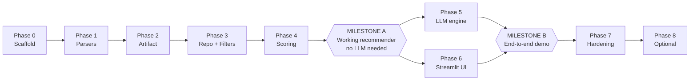

# Implementation Plan

Execution plan for the system specified in [`architecture.md`](./architecture.md), against the requirements in [`problemStatement.md`](./problemStatement.md).

The plan is organized into eight phases. Each phase lists its deliverables, the work involved, and an **exit criterion that can be checked by running something** — not by reading the code and feeling good about it. Phases are strictly ordered by dependency, except where noted as parallelizable.

Two companion documents: [`edge-case.md`](./edge-case.md) catalogues the corner scenarios each phase must handle, and [`eval.md`](./eval.md) defines the measurable gate each phase has to clear.

---

## Sequencing Principle

The riskiest and least glamorous work comes first: the messy field parsers and deduplication. Those are where bugs hide, where they are cheapest to find in isolation, and where a silent failure would quietly corrupt every downstream result.

The consequence worth internalizing: **the LLM arrives in Phase 5, not Phase 1.** By the end of Phase 4 there is a fully working recommender with deterministic ranking and no API key required. That ordering means when the LLM is added, any weird output can be attributed to the prompt or the model, because the candidate set feeding it is already known-good. Wiring the LLM up first is the most common way these projects become hard to debug.

Phases 5 and 6 can be built in parallel or in either order, since both depend only on Milestone A and not on each other.

---

## Validation Targets (Reference)

These numbers were measured from the raw dataset during architecture work. They are the ground truth for verifying Phases 2 through 4 — if your pipeline disagrees with these, the pipeline is wrong, not the table.

| Quantity | Expected |
| --- | --- |
| Raw rows | 51,717 |
| Rows after deduplication | **12,453** |
| Distinct `location` values | 93 |
| Distinct `city_area` values | 30 |
| Distinct meal contexts | 7 |
| Cost percentile p33 / p66 | **₹300 / ₹500** |
| Cost range | ₹40 – ₹6,000 |
| Global mean rating (`C`) | **3.625** |
| Parsed rating range | 1.8 – 4.9 |
| Unrated share after dedup | 25.6% |
| `"NEW"` rated rows | 2,208 |
| Median votes | 24 |

---

## Phase 0 — Scaffold and Configuration

**Goal:** a repository that installs cleanly and imports its own package, with nothing secret in git.

**Deliverables:** `pyproject.toml`, `.gitignore`, `.env.example`, `src/zomato_reco/config.py`, `src/zomato_reco/models.py`, empty package dirs, initialized git repo.

**Tasks:**

- [ ] `git init` (the project is not yet a repo) and commit the two existing docs.
- [ ] Create `pyproject.toml` with dependencies: `pandas`, `pyarrow`, `datasets`, `streamlit`, `pydantic>=2`, `pydantic-settings`, `openai`, and dev extras `pytest`, `ruff`.
- [ ] Set up a virtual environment and install the package in editable mode.
- [ ] Write `.gitignore` covering `data/`, `.env`, `__pycache__/`, `.venv/`. **Do this before the first data run**, so a 145 MB Parquet file never has the chance to land in git history.
- [ ] Write `config.py` with a `pydantic-settings` class holding: artifact paths, `llm_model`, `temperature=0.3`, `candidate_count=20`, `result_count=5`, `min_votes_m=50`, `relaxation_floor=5`, and the soft-preference weights.
- [ ] Write `.env.example` documenting `OPENAI_API_KEY` (and base URL if using an alternative provider). Never create a real `.env` with a key in it via a tool that logs.
- [ ] Write `models.py` with the `Restaurant`, `UserPreferences`, and `Recommendation` Pydantic models from architecture §6.3 and §8.2.

**Exit criterion:** `python -c "import zomato_reco; from zomato_reco.config import settings; print(settings.candidate_count)"` prints `20`, and `git status` shows no data or env files as untracked-but-ignorable.

**Blocking decision:** resolve the Bangalore-only scope question (architecture §11) before writing UI copy in Phase 6. It does not block Phases 0–5, so it can be deferred, but not forgotten.

*Rough effort: 1 short session.*

---

## Phase 1 — Cleaning Primitives

**Goal:** every messy field in the dataset has a tested pure function that parses it.

**Deliverables:** `src/zomato_reco/ingest/clean.py`, `tests/test_clean.py`.

This phase is deliberately test-first. The functions are small, pure, and the exact edge cases are already known from the data profile, so there is no excuse for discovering them later via a confusing UI bug.

**Tasks:**

- [ ] `parse_rating`: handle `"4.1/5"`, the whitespace variant `"4.1 /5"`, the literal `"NEW"` → `None`, **a bare `'-'` → `None`**, `None` → `None`, and any unexpected string → `None` rather than raising. The column has 65 distinct values; see `edge-case.md` §1.
- [ ] `parse_cost`: handle `"800"`, the comma form `"1,200"` → `1200`, and `None` → `None`.
- [ ] `parse_yes_no`: `"Yes"` → `True`, `"No"` → `False`, anything else → `False`.
- [ ] `split_multi`: `"North Indian, Chinese"` → `["North Indian", "Chinese"]`, with trimming, empty-string removal, and `None` → `[]`.
- [ ] `fix_encoding`: repair the mojibake sequences (`Ã` runs) seen in names and review text.
- [ ] `canonical_url` / `dedup_key`: strip the `?context=` query string from a Zomato URL. **This is the highest-stakes function in the phase** — see Phase 2.
- [ ] `extract_review_snippets`: safely pull at most 2 short snippets from the stringified list-of-tuples in `reviews_list`, truncate each, and never `eval` untrusted input carelessly (use `ast.literal_eval` inside a try/except).
- [ ] Table-driven tests for all of the above, including the null and garbage cases.

**Exit criterion:** `pytest tests/test_clean.py` passes, with an explicit test asserting that two URLs differing only in their `?context=` parameter produce the same dedup key.

*Rough effort: 1 session.*

---

## Phase 2 — Ingestion and the Cleaned Artifact

**Goal:** one reproducible command turns the raw Hugging Face dataset into `restaurants.parquet` + `facets.json`.

**Deliverables:** `src/zomato_reco/ingest/download.py`, `src/zomato_reco/ingest/build_artifact.py`, the generated artifacts.

**Tasks:**

- [ ] `download.py`: fetch the `train` split into `data/raw/`, cached so reruns are offline. Expect a ~150 MB download.
- [ ] In `build_artifact.py`, follow architecture §6.1 in order. Drop `menu_item` and `phone` and reduce `reviews_list` to snippets **before** any other processing — this is what keeps peak memory from exceeding half a gigabyte.
- [ ] Apply the Phase 1 parsers column by column.
- [ ] Deduplicate on the canonical URL path, keeping the highest-`votes` row per group, and aggregate the dropped siblings' `listed_in(type)` and `listed_in(city)` values into `meal_contexts` and `city_areas`.
- [ ] **Assert the deduplicated row count is within a tolerance of 12,453 and fail loudly otherwise.** Deduplicating on the raw `url` would leave all 51,717 rows and produce a UI that silently repeats restaurants; an assertion is the only cheap defense against that.
- [ ] Compute `id` (stable short hash of the canonical URL), the cost percentiles, `budget_band`, `C`, and `weighted_rating`.
- [ ] Derive the `is_family_friendly` and `is_quick_service` heuristic flags from `rest_types` and `meal_contexts`.
- [ ] Drop unusable rows: missing name, or missing both rating and cost.
- [ ] Write Snappy-compressed Parquet, plus `facets.json` containing sorted locations, city areas, cuisines, meal contexts, and the calibrated budget thresholds.
- [ ] Log a summary: rows in, rows out, computed p33/p66, computed `C`, and null counts per column.

**Exit criterion:** `python -m zomato_reco.ingest.build_artifact` completes and its summary matches the Validation Targets table — 12,453 rows, p33 ₹300, p66 ₹500, `C` 3.625. The artifact should be a few megabytes, not hundreds; if it is large, the `reviews_list` reduction did not happen.

**Risk:** this is the phase where a subtle parser bug does the most damage, because everything downstream inherits it. Spend the extra ten minutes eyeballing 20 random output rows against their raw counterparts.

*Rough effort: 1–2 sessions.*

---

## Phase 3 — Repository and Hard Filters

**Goal:** given a `UserPreferences` object, return exactly the restaurants that satisfy it.

**Deliverables:** `src/zomato_reco/data/repository.py`, `src/zomato_reco/recommend/filters.py`, `tests/test_filters.py`.

**Tasks:**

- [ ] `repository.py`: load the Parquet and `facets.json` once, cache in module state, and expose facet accessors for the UI plus the DataFrame for filtering. Fail with an actionable message ("run `python -m zomato_reco.ingest.build_artifact` first") when the artifact is absent.
- [ ] Implement each filter from architecture §7.1 as a separate composable function: location, budget band, minimum rating, cuisine overlap, meal-context overlap.
- [ ] Order the filter application cheapest-and-most-selective first.
- [ ] Ensure unrated restaurants are excluded when `min_rating` is set, rather than silently comparing against `None`.
- [ ] Tests on a small hand-built DataFrame: each filter in isolation, filters in combination, the empty-result case, and the unrated-exclusion rule.

**Exit criterion:** a scratch script filtering for a real neighborhood plus a real cuisine returns a plausible non-empty set, and an intentionally absurd query returns exactly zero rows without raising.

*Rough effort: 1 session.*

---

## Phase 4 — Scoring, Relaxation, and Milestone A

**Goal:** ranked, sensible recommendations with zero LLM involvement.

**Deliverables:** `src/zomato_reco/recommend/scoring.py`, the relaxation logic, `src/zomato_reco/recommend/pipeline.py` (deterministic path only), `tests/test_scoring.py`.

**Tasks:**

- [ ] Implement soft-preference boosts: keyword-match the free-text extras against `rest_types`, `meal_contexts`, `dish_liked`, and the convenience booleans, adding configured weights to `weighted_rating`.
- [ ] Implement progressive relaxation in the fixed order from architecture §7.2: meal context, then cuisine, then rating (−0.3), then location, with **budget relaxed last**. Return the applied relaxations as structured data, not log lines — the UI has to show them.
- [ ] **Do not relax location by widening to `city_areas`** — it is a listing area, not a parent region, and doing so returns 60–73% of the whole dataset. Use an adjacency map or drop the constraint with a notice. See `edge-case.md` **C2**.
- [ ] Add a deterministic tie-break (votes, then `id`). 147 restaurants share the exact same rating and cost, so without one the ranking order is unstable across runs.
- [ ] Cap outlets per brand in the visible results: Cafe Coffee Day alone has 54 outlets, and 328 brand/neighborhood pairs have multiple.
- [ ] Implement `select_candidates`: filter → relax if under the floor → score → return the top 20.
- [ ] Implement the deterministic fallback explanation templates over real fields ("4.4 rating from 1,200 votes, ₹600 for two, serves North Indian"). Phase 5 depends on these existing already.
- [ ] Assemble the deterministic `pipeline.recommend()` returning the top 5 with template explanations.
- [ ] Tests: a 4.9-rated restaurant with 4 votes must not outrank a 4.5 with 3,000; relaxation must trigger below the floor and record what it changed.

**Exit criterion — MILESTONE A:** a CLI or notebook call to `pipeline.recommend()` with realistic preferences returns 5 restaurants that a human would agree are reasonable, with no API key configured anywhere. Sanity-check several neighborhoods and budget bands, since this output is the input the LLM will later rank.

*Rough effort: 1–2 sessions.*

---

## Phase 5 — LLM Recommendation Engine

**Goal:** LLM-generated ranking and explanations, with structural guarantees that it cannot fabricate facts.

**Deliverables:** `src/zomato_reco/llm/{base,openai_client,prompts,parser}.py`, `tests/test_parser.py`, LLM path in `pipeline.py`.

**Tasks:**

- [ ] `base.py`: the `LLMClient` protocol (`complete_json`).
- [ ] `openai_client.py`: concrete implementation with JSON response mode, configured temperature, bounded `max_tokens`, a request timeout, and one retry with backoff.
- [ ] `prompts.py`: the system prompt with the non-negotiable rules (recommend only from candidates, reference by exact `id`, never invent or alter facts, 1–2 sentences per explanation tied to stated preferences, name the tradeoff on imperfect fits, JSON only), and the user-message builder serializing preferences plus compact candidate JSON.
- [ ] Keep candidate serialization lean — no URLs, addresses, or raw review dumps. Verify the assembled prompt is in the expected 2,000–2,500 token range.
- [ ] `parser.py`: the six-step validation gate from architecture §8.3, in order — parse, schema-validate, **allowlist-check every returned `id`**, dedupe and renumber ranks, backfill from deterministic order if short, and **discard every factual field the model returned**, re-joining name/cuisine/rating/cost from the dataset by ID.
- [ ] Wire the failure-mode matrix from §8.4: missing key, timeout, 429, malformed JSON, hallucinated IDs, empty candidates. Every path must fall back to Phase 4's deterministic output rather than erroring.
- [ ] Tests with a stub client: hallucinated IDs dropped, duplicate IDs collapsed, malformed JSON handled, short responses backfilled, and a fabricated rating in the model's JSON **not** reaching the output.

**Exit criterion:** with a real API key, recommendations come back with explanations that reference actual preferences. With the key removed, the identical call still returns 5 results via templates. The test suite passes without any API key present.

**Note on cost:** each request is a few thousand tokens. Development iteration is cents, not dollars, but add the response cache in Phase 7 before any repeated demoing.

*Rough effort: 2 sessions.*

---

## Phase 6 — Streamlit UI and Milestone B

**Goal:** a person who has never seen the code can get recommendations.

**Deliverables:** `app/streamlit_app.py`, `src/zomato_reco/ui/components.py`.

**Tasks:**

- [ ] Sidebar form driven entirely by `facets.json`: location dropdown, budget radio **labelled with the real rupee ranges** ("medium — ₹300–₹500 for two"), cuisine multi-select, rating slider, free-text extras box, result-count selector.
- [ ] Build `UserPreferences` from the form and call `pipeline.recommend()`. The UI must contain no filtering or ranking logic of its own.
- [ ] Result cards: rank and name heading, cuisine tags, rating with vote count, cost for two, the explanation, convenience badges, and a Zomato link.
- [ ] Relaxation notices above the results, phrased in plain language.
- [ ] The "why this rank" expander per card showing deterministic score components, which keeps the ranking auditable.
- [ ] Handle all four states from architecture §9: initial, loading, zero-results-after-relaxation, and degraded (template explanations) with a visible banner.
- [ ] Apply the resolved scope decision to all user-facing copy — do not label a neighborhood dropdown "City".

**Exit criterion — MILESTONE B:** `streamlit run app/streamlit_app.py`, then complete a full search through the UI and get useful cards. Deliberately over-constrain a query and confirm the relaxation notice explains what happened. This is the demoable state and satisfies every stage of the problem statement.

*Rough effort: 1–2 sessions.*

---

## Phase 7 — Hardening

**Goal:** predictable cost, debuggable behavior, and confidence that a refactor won't break the pipeline.

**Deliverables:** caching, structured logging, `tests/test_pipeline.py`, `README.md`.

**Tasks:**

- [ ] Cache the artifact load for the process lifetime via `st.cache_data`.
- [ ] Cache LLM responses on `hash(preferences + candidate_ids + model + result_count)`, which makes repeat searches free and instant — the common case while demoing.
- [ ] Structured per-request logs: candidate count, relaxations applied, LLM latency, token usage, cache hit/miss, validation drops. Token usage and dropped-ID counts are the two worth actually watching.
- [ ] End-to-end pipeline test with a stub LLM client, so CI never needs a key.
- [ ] `ruff` clean.
- [ ] `README.md`: setup, the ingestion command, how to run the app, and how to run without an API key.

**Exit criterion:** full `pytest` green with no API key in the environment; a repeated identical search visibly logs a cache hit and returns immediately.

*Rough effort: 1 session.*

---

## Phase 8 — Optional Extensions

Only after Phase 7. Each is independent, and none is required by the problem statement.

- [ ] Semantic search over `dish_liked` and review snippets, for free-text preferences that keyword matching handles poorly. This is where embeddings genuinely earn their place — unlike the structured filters, where they would be worse than pandas.
- [ ] Conversational refinement ("cheaper, but keep it Italian") via a chat loop over retained candidate state.
- [ ] A FastAPI layer, which is cheap to add because the business logic is already plain functions behind Streamlit.
- [ ] Richer review mining, given that ingestion currently discards most review text for size.
- [ ] Evaluation harness: a fixed set of preference profiles with recorded outputs, to catch prompt-change regressions.

---

## Minimum Viable Path

If time is short, Phases 0 through 6 deliver everything the problem statement asks for. Within those, the parts that cannot be cut without breaking a stated requirement or risking incorrect output are:

**Non-negotiable:** the dedup assertion in Phase 2 (silent failure, visibly broken results); the ID allowlist and fact-rejoin gate in Phase 5 (the entire defense against fabricated recommendations); the deterministic fallback in Phase 4 (without it, any API hiccup is a broken demo).

**Safe to defer:** the "why this rank" expander, soft-preference boosts (the LLM interprets extras from the prompt regardless), the relaxation chain beyond its first step, structured logging, and everything in Phase 8.

---

## Progress Tracking

| Phase | Deliverable | Exit check | Done |
| --- | --- | --- | --- |
| 0 | Scaffold, config, models | Package imports, settings load | ☐ |
| 1 | Tested field parsers | `pytest tests/test_clean.py` | ☐ |
| 2 | `restaurants.parquet` + facets | 12,453 rows; ₹300/₹500; C=3.625 | ☐ |
| 3 | Repository + hard filters | Real query non-empty, absurd query empty | ☐ |
| 4 | Scoring + relaxation | **Milestone A:** sensible results, no LLM | ☐ |
| 5 | LLM engine + validation gate | Explanations work; fallback works keyless | ☐ |
| 6 | Streamlit UI | **Milestone B:** full search in browser | ☐ |
| 7 | Caching, logging, e2e test | `pytest` green without a key | ☐ |
| 8 | Extensions | As scoped | ☐ |
